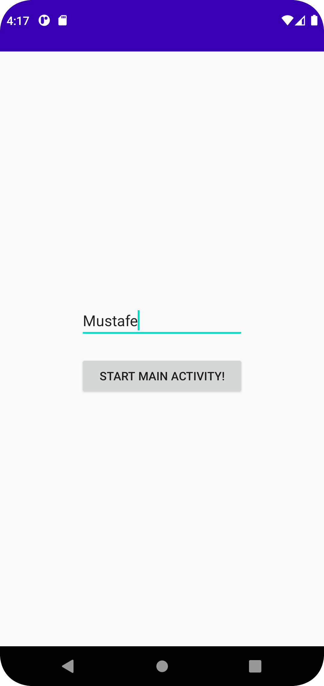
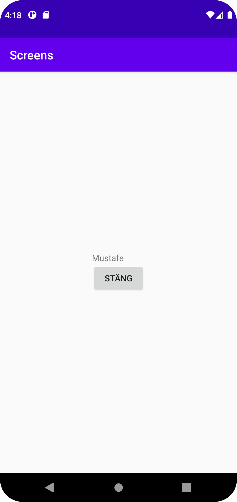

# Rapport

**fgfgfg **

_Du kan ta bort all text som finns sedan tidigare_.

## Följande grundsyn gäller dugga-svar:

- Ett kortfattat svar är att föredra. Svar som är längre än en sida text (skärmdumpar och programkod exkluderat) är onödigt långt.
- Svaret skall ha minst en snutt programkod.
- Svaret skall inkludera en kort övergripande förklarande text som redogör för vad respektive snutt programkod gör eller som svarar på annan teorifråga.
- Svaret skall ha minst en skärmdump. Skärmdumpar skall illustrera exekvering av relevant programkod. Eventuell text i skärmdumpar måste vara läsbar.
- I de fall detta efterfrågas, dela upp delar av ditt svar i för- och nackdelar. Dina för- respektive nackdelar skall vara i form av punktlistor med kortare stycken (3-4 meningar).

Programkod ska se ut som exemplet nedan. Koden måste vara korrekt indenterad då den blir lättare att läsa vilket gör det lättare att hitta syntaktiska fel.

```

    setContentView(R.layout.activity_main);
    String name = "Mustafe";

        Intent intent =getIntent();
        if (intent != null){
           String temp = intent.getStringExtra("name");
           if (temp != null) {
               name = temp;
            }
        }

        TextView text = findViewById(R.id.text);
        text.setText(name);

        Button close = findViewById(R.id.close);
        close.setOnClickListener(new View.OnClickListener() {
            @Override
            public void onClick(View view) {
                Log.d("Main", "Start Aktivity");
                finish();
            }
        });
        
        
setContentView(R.layout.activity_second);
final EditText password = findViewById(R.id.password);

        Button  oppen = findViewById(R.id.open);
        oppen.setOnClickListener(new View.OnClickListener() {
            @Override
            public void onClick(View view) {
                String passwordText = password.getText().toString();
                Log.d("TAG", "Start aktivitet med passwoed" + password );

                Intent intent = new Intent(SecondActivity.this, MainActivity.class);
                intent.putExtra("name", passwordText);
                startActivity(intent);

            }
        });
        
```

Bilder läggs i samma mapp som markdown-filen.




Läs gärna:

- Boulos, M.N.K., Warren, J., Gong, J. & Yue, P. (2010) Web GIS in practice VIII: HTML5 and the canvas element for interactive online mapping. International journal of health geographics 9, 14. Shin, Y. &
- Wunsche, B.C. (2013) A smartphone-based golf simulation exercise game for supporting arthritis patients. 2013 28th International Conference of Image and Vision Computing New Zealand (IVCNZ), IEEE, pp. 459–464.
- Wohlin, C., Runeson, P., Höst, M., Ohlsson, M.C., Regnell, B., Wesslén, A. (2012) Experimentation in Software Engineering, Berlin, Heidelberg: Springer Berlin Heidelberg.
